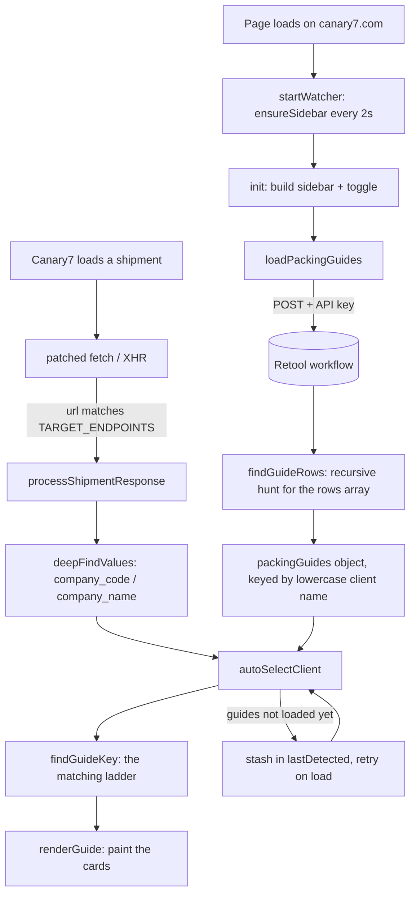

# malpa-packguide.user.js — Packing Guide Sidebar

A Tampermonkey userscript that shows packers **how to pack each client's orders**, in a sidebar
inside the Canary7 pack window. Every client packs differently — different mailer, different
voidfill, different thank-you card rules — and this puts that client's instructions on screen
automatically, without the packer having to look anything up.

- **Runs on:** `https://*.canary7.com/*` (the Canary7 WMS UI)
- **Repo:** `github.com/Malpa-3PL/Warehouse-Scripts`
- **Raw / install URL:** `https://raw.githubusercontent.com/Malpa-3PL/Warehouse-Scripts/main/malpa-packguide.user.js`
- **Version documented here:** 18.1
- **Guide content lives in Retool, not in this file** — see [Where the content comes from](#where-the-content-comes-from)

---

## TLDR — the whole script in 6 lines

1. On page load, it POSTs to a Retool workflow and gets back one row per client (48 currently).
2. It builds a sidebar (hidden, off-screen right) with a client dropdown and a toggle button.
3. It **monkey-patches `fetch` and `XMLHttpRequest`** to watch Canary7's own API traffic.
4. When Canary7 loads a shipment to pack, the script reads the company off that response.
5. It matches that company to a guide row and renders that client's cards — **without opening the sidebar**.
6. So when the packer clicks the sidebar open, the right guide is already showing.

The sidebar never auto-opens. It only ever pre-selects.

---

## What a packer sees

Up to five cards, in this fixed order:

| Card | Colour | Shows when empty? |
|---|---|---|
| Thank you card | green if required / grey if not | **always** — says "Not required" |
| Critical considerations | red | **hidden** |
| Pack into | blue | **always** — shows `-` |
| Voidfill | yellow | **always** — shows `N/A` |
| Packing method | blue | **hidden** |

Three cards always render, so a client can never produce a completely empty sidebar. The leanest
real client is BB Love Oils at 3 cards.

---

## Data flow



The two halves run **independently and in either order**. That race is the single most important
thing to understand about this file — see [Gotchas](#gotchas-read-before-editing).

---

## Where the content comes from

Nobody edits packing instructions in this script. They live in a Retool table, fetched at runtime:

```
POST https://api.retool.com/v1/workflows/6b5ceb37-3b77-46b2-b547-a674bb7c993a/startTrigger
Header: X-Workflow-Api-Key: retool_wk_...
Body:   {}
```

Each row looks like this:

```json
{
  "client_name": "Boob to Food",
  "pack_into": "Custom mailer box, Custom satchel",
  "packing_method": "Place book/s into custom mailer box...",
  "voidfill": "Kraft paper",
  "considerations": "Custom mailer boxes come in two sizes...",
  "thankyou_card_required": false
}
```

Only those six fields are read. `packing_method`, `voidfill` and `considerations` are frequently
`""` or JSON `null` — that is normal and handled.

**To change what a packer reads, edit the Retool table.** No code change, no version bump, no
redeploy. Changes appear on the next page load.

> **There is no `company_code` column.** This is the root of most auto-select bugs. Canary7 knows
> the client as a short code (`HBC`, `GOAT`, `BTF`); Retool only knows the full name
> (`Boob to Food`). The script bridges that gap by guessing — see below.

---

## How auto-select matches a company to a guide

`findGuideKey()` tries each candidate string (company code *and* company name) against every guide,
stopping at the first hit. Everything is normalised first — lowercased, all non-alphanumerics
stripped — so `Burleigh & Co` becomes `burleighco`.

| # | Rule | Example | Guard |
|---|---|---|---|
| 0 | `CODE_OVERRIDES` lookup | whatever you put there | — |
| 1 | Exact normalised name | `HBC` → HBC | — |
| 2 | Initials | `BTF` → Boob to Food | 2+ chars, must be unambiguous |
| 3 | Prefix, either direction | `ALPHA` → Alphabet Legends | 3+ chars, must be unambiguous |
| 4 | Contains, either direction | `unrefined` → Unrefined Nutrients | 4+ chars, must be unambiguous |

"Unambiguous" means exactly one guide matched. If two matched, that rung is skipped rather than
guessing — showing the wrong client's guide is worse than showing none.

**When it fails**, the console says:

```
[Packing Guides] NO MATCH for company ["XYZ"] - add an entry to CODE_OVERRIDES to fix this client.
```

That is the fix. Open the script, add one line, bump the version, ship:

```js
const CODE_OVERRIDES = {
    'btf': 'Boob to Food',
};
```

Key = the Canary7 company code, lowercase. Value = `client_name` **exactly** as spelled in Retool.

---

## Map of the file

~1,270 lines, one IIFE, no build step, no dependencies. Line numbers are as of v18.1 and will
drift — search by function name.

| Line | Section | What it does |
|---|---|---|
| 1–14 | Metadata block | `@version`, `@match`, `@grant`, update URLs |
| 28–34 | Config | `SIDEBAR_WIDTH`, Retool URL, API key |
| 54 | `CODE_OVERRIDES` | manual company-code → client-name fixes |
| 67 | `TARGET_ENDPOINTS` | which Canary7 URLs carry a company |
| 79–87 | State | `packingGuides`, `guidesLoaded`, `lastDetected`, `PAGE` |
| 97–188 | Helpers | `norm`, `initials`, `findGuideRows`, `deepFindValues` |
| 191 | `loadPackingGuides` | the Retool fetch + row parsing |
| 312–355 | Error / empty states | `showError`, `renderEmptyState`, `setSubtitle` |
| 358 | `init` | **the big one** — CSS, sidebar DOM, toggle, event wiring |
| 706 | `populateDropdown` | client list, sorted A–Z |
| 757 | `hasContent` | the null / blank / `"null"` test |
| 769 | `formatBullets` | splits text on newlines and `•` into `<li>`s |
| 800 | `renderGuide` | builds the five cards |
| 947 | `findGuideKey` | the matching ladder |
| 1016 | `autoSelectClient` | match + render + remember |
| 1083 | `processShipmentResponse` | pull the company out of C7's response |
| 1127–1200 | Interception | the `fetch` and `XHR` patches |
| 1206 | `ensureSidebar` | self-heal — recreate if C7 wiped it |
| 1257 | `startWatcher` | boot + the 2-second interval |

---

## Cookbook — the changes you'll actually make

### Change packing instructions for a client
Retool. Not this file.

### A client isn't auto-selecting
Add to `CODE_OVERRIDES` (line 54). See [the matching ladder](#how-auto-select-matches-a-company-to-a-guide).

### Change what an empty field shows

- **Hide the card entirely** — wrap it like `considerationsCard` (line 849):
  ```js
  const myCard = hasContent(guide.myField) ? `...html...` : '';
  ```
  then drop `${myCard}` into the `container.innerHTML` template.
- **Always show it with placeholder text** — pass a fallback to `formatBullets`:
  ```js
  ${formatBullets(guide.voidfill, 'N/A')}   // empty -> "N/A"
  ${formatBullets(guide.packInto)}          // empty -> "-"
  ```

### Add a new card

1. Add the column in Retool.
2. Read it in `loadPackingGuides` (~line 270): `myField: row.my_field || '',`
3. Add a colour trio to the `<style>` block if you want a new one — `.tm-card-x`,
   `.tm-icon-x`, `.tm-x-text` (line ~449).
4. Build the card in `renderGuide` and place it in the template.

### Change the colours, width or layout
All CSS is one template string inside `init()`, injected once as `#tm-sidebar-styles`.
Width is `SIDEBAR_WIDTH` (line 28) — it drives the panel width, its off-screen position and the
page-shift transform, so change the constant, never the individual values.

### Watch a different Canary7 endpoint
Add a URL substring to `TARGET_ENDPOINTS` (line 67). Company extraction is a recursive key search
(`deepFindValues`), so it usually needs no change — it looks for `company_code`, `companyCode`,
`company_name`, `companyName`, `client_code`, `clientCode` at any depth.

---

## Gotchas — read before editing

**1. The load race is the bug that keeps coming back.**
Canary7's shipment call almost always beats the Retool fetch. Detection that arrives before the
guides exist is stashed in `lastDetected` and replayed by `reapplyDetection()` once they load.
If you refactor `loadPackingGuides` or `autoSelectClient`, keep that replay path alive — v17 dropped
it and auto-select "worked sometimes" for months.

**2. `init()` must stay idempotent, because it runs every 2 seconds.**
`ensureSidebar()` fires on a `setInterval` and rebuilds the sidebar if Angular wiped it. So `init()`
guards on `#tm-sidebar` existing and on `#tm-sidebar-styles` existing. Anything you add to `init()`
needs the same treatment or it will duplicate 30 times a minute. Equally: guides are cached in
module scope so a rebuild does **not** re-hit Retool.

**3. `window.fetch` assignment does not work in the Tampermonkey sandbox.**
That is why the script grants `unsafeWindow` and patches `PAGE.fetch`, where
`PAGE = unsafeWindow || window`. Patching `XMLHttpRequest.prototype` works either way. Both patches
carry a re-entry guard (`__tmPackFetchPatched`, `__tmPackPatched`) so a rebuild can't double-wrap
them. **Never** change `PAGE` back to `window`.

**4. Bump `@version` on every change, or the fleet never updates.**
Tampermonkey only auto-updates when the remote `@version` is higher than the installed one.
`raw.githubusercontent.com` caches for ~5 minutes, so a fresh commit can appear stale briefly —
hard-reload or append `?v=x` to check.

**5. The API key is in this file, in a public repo.**
`retool_wk_...` is world-readable. It is a read-only guide fetch, so the blast radius is small, but
expect that GitHub or Retool secret-scanning may revoke it one day — at which point the sidebar
shows "Failed to load packing guides" for everyone. The real fix is proxying the fetch through
`malpasoft.com` so no key ships client-side.

**6. Add to Canary7's chrome; never reparent or restyle it.**
The toggle button is appended into `.app-header .nav-item`, falling back to `<body>` if the nav
hasn't rendered yet (`ensureSidebar` re-homes it later). Every tab bug in this repo's history came
from breaking this rule.

**7. Everything is prefixed `tm-`.** Keep it that way — the page is a live Angular app.

---

## Debugging

Everything logs under `[Packing Guides]`. A healthy boot:

```
[Packing Guides] Script booting... v18.0
[Packing Guides] Starting persistent watcher
[Packing Guides] Sidebar missing - creating
[Packing Guides] Initialising UI...
[Packing Guides] Loading packing guides...
[Packing Guides] Workflow response: 200
[Packing Guides] Rows found: 48
[Packing Guides] Auto-selected HBC from ["HBC"]
```

| Symptom | Look at |
|---|---|
| `Rows found: 0` | Retool changed its response shape — `findGuideRows` walks the payload looking for an array whose first object has `client_name` / `pack_into` / `client`. The raw payload is logged next to the warning. |
| `NO MATCH for company` | `CODE_OVERRIDES` |
| Nothing logs at all | Not a `canary7.com` URL, or the script is disabled |
| No sidebar, but logs appear | `ensureSidebar` needs both `app-dashboard`/`.app-body` **and** `.app-header` before it will build |
| Two sidebars / two toggles | Two copies installed in Tampermonkey. Check for a leftover entry under the old `http://tampermonkey.net/` namespace. |
| Guide never changes between shipments | The pack-container call wasn't re-issued, or its URL no longer matches `TARGET_ENDPOINTS` |

There is **no** `window.__packguide` debug handle on this script, unlike the handheld scripts. Worth
adding.

---

## Release

1. Edit the file.
2. Bump `@version` (line 4).
3. Commit and push to `main` in `Malpa-3PL/Warehouse-Scripts`.
4. Verify the raw URL serves the new version before telling anyone it shipped.

The install/update URLs inside the metadata block must match the file's actual path in the repo, or
auto-update silently dies. Renaming the file means editing those two lines too.

---

## Known issues

1. **The boot log lies about the version.** `console.log` has `v18.0` hardcoded (line 20) while
   `@version` is `18.1`, so the console misreports what's running. Fix — read it from the metadata
   instead:
   ```js
   const SCRIPT_VERSION =
       (typeof GM_info !== 'undefined' && GM_info.script && GM_info.script.version) || 'unknown';
   console.log('[Packing Guides] Script booting... v' + SCRIPT_VERSION);
   ```
2. **Thank-you text is duplicated for ~10 clients.** Axel & Ash, Cooloola, Force Tape, LACALUT and
   others have `considerations` reading only "Thank You Card Required", which now repeats the
   dedicated green card directly above it. Either strip that line at render time or clean it out of
   Retool.
3. **API key is public** — see gotcha 5.
4. **No debug handle** — see Debugging.
5. **`SIDEBAR_WIDTH` shifts the whole app** via a transform on `app-dashboard`. On a narrow packing
   monitor that can push content off-screen.
